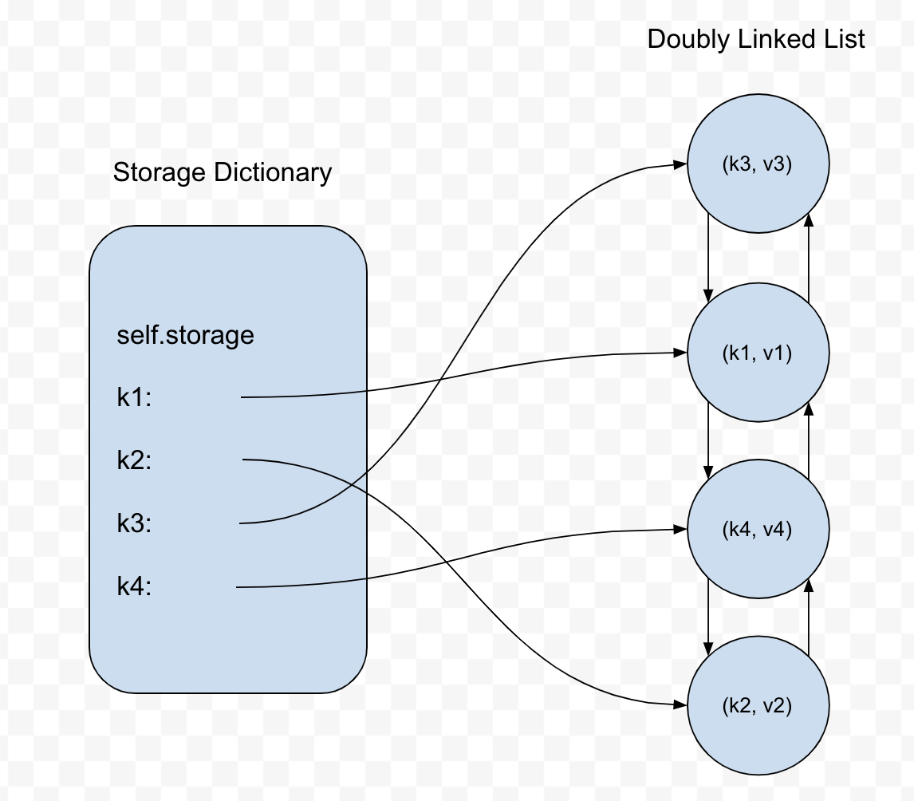
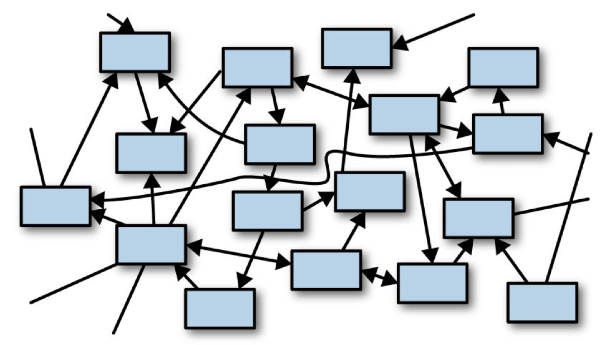
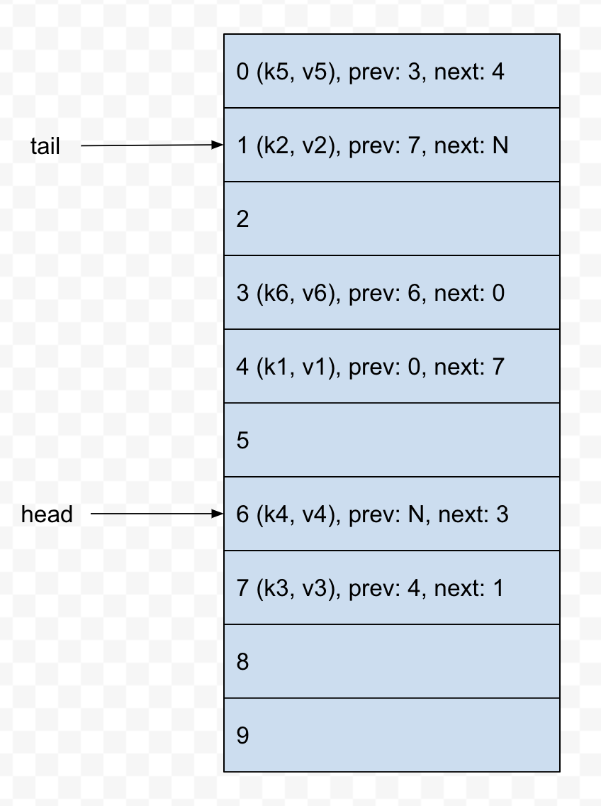

# Implementing an LRU Cache in Rust
_January 23rd, 2021 | #rust | #python | #data_structures | #intermediate_

> Note: This post assumes familiarity with traits in Rust. If you aren’t familiar with them, I’d recommend reading more about them. The [chapter](https://docs.rust-lang.org/book/ch10-02-traits.html)
in the official Rust book is as good a place as any 🙂

LRU caches are one of my favorite data structures to teach. One way of implementing an LRU cache (in Python, the language that I teach in) requires combining two separate data structures: a hash map in order to enable efficient access via hashing of keys, and a doubly-linked list in order to maintain the ordering of cache elements. 

However, structuring an LRU cache implementation in the same way in Rust would likely make it really clunky and difficult, since [implementing doubly linked lists in Rust is hard][too-many-lists]. We’ll need to come up with a different strategy when we get around to implementing it Rust. But first, let’s see the Python implementation. 

> Note: I’m aware that Python’s dictionary implementation orders key-value pairs by insertion order, so we could just take advantage of that feature in our LRU cache implementation as a way to keep track of the order of cache entries. However, this would obviate the learning exercise. We’ll be disregarding this feature for our Python implementation. 

# Coming up with Requirements for our Cache 

The job of a cache is to store data and/or objects such that subsequent accesses are performed more quickly than the initial access. By design, caches are meant to be kept small in order to speed up read operations. An important question then when designing a cache is “what gets kept and what gets evicted when the cache reaches capacity?”. 

An LRU (or Least Recently Used) cache employs a fairly straightforward strategy: the data that was accessed the longest time ago is what is evicted from the cache. In order to do this, our LRU cache needs to keep track of the order in which elements (which take the form of key-value pairs) it holds are inserted and fetched. 

Whenever an element is inserted into or fetched from the cache, that element becomes the newest element in the cache. Additionally, if the cache is already at max capacity when we insert a new element, then the eviction routine needs to be executed in order to remove the oldest cache element and make room for the new cache element. 

So our LRU cache will need an `insert` operation as well as a `fetch` operation. It will also need an `evict` operation, though we’ll opt to not expose this method as part of our cache’s public API. 

# Our Python Implementation

With a loose specification of the requirements of our LRU cache, we can define the constructor as such:

```python
from doubly_linked_list import DoublyLinkedList

class LRUCache:
    def __init__(self, capacity=100):
	    # the max number of entries the cache can hold
	    self.capacity = capacity
	    # the hash map for storing entries as key-value pairs 
	    # it’s what allows us to efficiently fetch entries 
	    self.storage = dict()
	    # a doubly linked list for keeping track of the order
    	# of elements in our cache 
    	self.order = DoublyLinkedList()
```

{}
We won’t be going over the design and implementation of the `DoublyLinkedList` that we’re using here, though its code is included in the GitHub repo should you wish to take a look. 
{}

Our cache’s constructor receives a single optional parameter specifying the maximum number of entries that the cache can hold, which is stored in the `self.capacity` variable. The `self.storage` dictionary associates keys with the contents of the cache that we actually care about. `self.order` stores a `DoublyLinkedList` whose sole job is to keep track of the order of entries in the cache: the newest entry in the list will always be at the head of the list, and the oldest entry will always be at the tail. 

Let’s first define our `insert` method. It takes a key-value pair, where the value is the actual cached content that we care about, and the key is some sort of key that allows us to access the cached content. If the key isn’t already contained in the cache, it needs to be added to the `self.storage` dictionary, and we’ll also add the key as a node at the head of the `self.order` linked list. However, if the key already exists in the cache, then we want to only overwrite its value instead of re-inserting the key into the cache with a new value. 

Additionally, if it turns out the cache is already at max capacity, we’ll need to evict the oldest entry in the cache:

```python
	def insert(self, key, value):
		# if the key is already in the cache, overwrite 
		# its value 
		if key in self.storage:
			entry = self.storage[key]
			entry.data = (key, value)
			# touch this entry to move it to the head of 
			# the linked list
			self.touch(entry)
			return
			
		# check if our cache is at max capacity to see
		# if we need to evict the oldest entry 
		if len(self.storage) == self.capacity:
			self.evict()
			
		# add the key and value as a node at the 
		# head of our doubly linked list 
		self.order.add_to_head((key, value))
		# add the linked list node as the value of 
		# the key in our storage dictionary
		self.storage[key] = self.order.head
```

Each linked list node is storing a tuple of the `key` and the `value`. Each key-value pair in `self.storage` consists of the `key` as its key and a linked list node as its value:



Let’s implement the `touch` method, which is responsible for moving an entry in our cache to the most-recently-added spot in our cache. Our doubly linked list implementation has a method `move_to_front` that takes a node and does the work of moving it from wherever it is in the list to the head; we’ll use it here in our `touch` implementation:

```python
	def touch(self, entry):
		self.order.move_to_front(entry)
```

The `evict` method is responsible for removing the oldest entry in the cache and is called only when we attempt to insert into the cache when it is already at max capacity. It needs to remove the node at the tail of the linked list, as well as make sure the key that referred to the oldest entry is also removed from `self.storage`:

```python
	def evict(self):
		# delete the key-value pair from the storage dict 
		# we can get the oldest entry’s key by accessing 
		# it from the tail of the linked list 
		key_to_delete = self.order.tail.data[0]
		del self.storage[key_to_delete]
		
		# remove the tail entry from our linked list 
		self.order.remove_from_tail()
```

Now we need to implement the `fetch` method which accepts a key to an entry in the cache, checks whether the key exists, then returns the value associated with the key. This method also moves the entry to the head of the linked list as this entry is now the most-recently-used entry in the cache.

```python
	def fetch(self, key):
		if key not in self.storage:
			return 
		
		entry = self.storage[key]
		self.touch(entry)
		return entry.data[1]
```

The full code for the Python implementation, as well as a suite of tests, can be found [here][python-impl]. 

# Transitioning to a Rust Implementation

Our Python implementation liberally allocates objects in memory, most notably the two distinct data structures, a dictionary and a doubly linked list (which itself allocates lots of linked list nodes), with linked list nodes referring to one another, along with the dictionary referring to these nodes as well. This is an example of what Jim Blandy and Jason Orendorff call a “sea of objects” in their book  _Programming Rust_:



Automatic memory management makes this kind of memory architecture tenable: cyclical references are handled by the garbage collector. The tradeoff here is that programmers are able to develop working software without having to do as much up-front planning, at the cost of taking a performance hit due to the garbage collection process. 

When it comes to implementing this same data structure in Rust, opting to go with the same high-level design of using a doubly linked list to keep track of the order of cache entries and then storing those linked list nodes as values in a dictionary for efficient access will lead to very messy and clunky code in the best case, and unsafe code in the worst case. Implementing a doubly linked list in Rust, at least in the “traditional” way, is, as we mentioned earlier, not straightforward.

So we’ll need to go back to the drawing board and come up with a different architecture. Of the two data structures we used in our Python implementation, the doubly linked list is certainly the more vital of the two: it maintains the order of cache entries, is cheap to insert into and remove from, and provides us direct access to the most-recently- and least-recently-used entries in the cache so long as we maintain the invariant that these entries live at the ends of the linked list. 

But wait, didn’t we just mention that doubly linked lists are a pain to implement in Rust? 

Well, I said that they’re a pain to implement in Rust in the “traditional” way, using nodes and references between those nodes. The reason why is due to the ownership system that dictates that every heap-allocated memory object can only have one owner at any point in time. Doubly linked lists buck this rule since each node, by design, is referred to by two nodes at once. Thus, implementing a node-based doubly linked list either requires liberal use of `Rc`s (which impose runtime checks) or unsafety. 

But wait! There’s actually a third route we could take that circumvents these issues. We’ll implement our doubly linked list using an array 🙂 

Each “node” in our array-backed doubly linked list, instead of referencing other node objects directly, will instead refer to the array indices where the node’s previous and next nodes reside in the array. This is certainly a more abstract way to implement a doubly linked list, though it gets the job done and has some important benefits for our use case, most notably that introducing an extra level of indirection by having each linked list node reference the array index of another linked list node completely circumvents the multiple owners issue that comes with the territory of doubly linked lists. 



Now, since all of our cache entries are being stored in an array, it would be straightforward to layer on a `HashMap` as part of our implementation where we store keys that are associated with a particular cache entry’s index in the array. 

However, instead of opting for this design, which would map relatively closely with the design of our Python implementation, we’re going to ditch the inclusion of a `HashMap` and actually just use our array-backed doubly linked list for our Rust implementation. This design decision means that we’re going to lose the ability to access arbitrary cache entries in constant time, but on the plus side, our cache will have a smaller memory footprint since we aren’t using another data structure. 

## Implementing the Rust Version of our Cache

Let’s start off by defining an `Entry` type inside the `src/lib.rs` file of a new Rust project. This type will represent every entry in our cache and wrap some arbitrary piece of data that we want stored in the cache. Note that this type also doubles as our linked list node type as it refers to the previous and next entries in the cache.

```rust
pub struct Entry<T> {
	/// The value stored in this entry
	val: T,
	/// Index of the previous entry in the cache
	prev: usize,
	/// Index of the next entry in the cache
	next: usize,
}
```

Next, our `LRUCache` type, which is responsible for storing an array of `Entry`s, as well as `head` and `tail` indices where the most-recently-used and least-recently-used `Entry`s are stored, respectively. The array will have a fixed size that can be specified when the `LRUCache` is initialized. Rust’s vanilla `array` [type][array] doesn’t actually satisfy this requirement ([yet][const-generics]), so we’ll need to import a crate that provides us with this capability, namely the `ArrayVec` [crate][arrayvec].

### Bringing in `ArrayVec` as a Dependency

First, add it as a dependency in your project’s `Cargo.toml` file:

```
[dependencies]
arrayvec = “0.5.2”
```

Then in `src/lib.rs`:

```rust
use arrayvec::ArrayVec;

pub struct LRUCache {
	/// Our `ArrayVec` will be storing `Entry`s 
	entries: ArrayVec<Entry>,
	/// Index of the first entry in the cache
	head: usize,
	/// Index of the last entry in the cache
	tail: usize,
	/// The number of entries in the cache
	length: usize,
}
```

If you try compiling what we have so far with `cargo build`, you should get an error like this:

```
error[E0107]: wrong number of type arguments: expected 1, found 0
  --> src/main.rs:11:23
   |
11 |     entries: ArrayVec<Entry>,
   |                       ^^^^^ expected 1 type argument

error: aborting due to previous error
```

To figure out what’s wrong here, we can look at ArrayVec’s [documentation][arrayvec-docs]. One of the code snippets that demonstrates how to initialize a new `ArrayVec` instance looks like this:

```rust
use arrayvec::ArrayVec;

let mut array = ArrayVec::<[_; 16]>::new();
```

The `<[_; 16]>` in this initialization is specifying up-front that the new `ArrayVec` will have a capacity of 16 and hold some unknown type (denoted by the `_`) that the compiler should infer later. This is the piece we’re missing in our code. But the whole point of bringing in and using `ArrayVec` was so that we could generalize over the capacity. How do we do that? 

If you search around `ArrayVec`’s docs, you might come across the `Array` [trait][array-trait]. This is what will allow us to generalize over the capacity of a new `ArrayVec` instance. When we go to initialize a new `LRUCache` instance, we can do so with something like this:

```rust
// An `LRUCache` that holds at most 4 `Entry<i32>`s
let cache = LRUCache<[Entry<i32>; 4]>;
```

You can think of the `Array` trait as a kind of placeholder that ensures that when it’s time to initialize an instance of our `LRUCache`, that the user specifies the type the cache will be holding and its capacity.  

We’ll change our code to use this trait:

```rust
use arrayvec::{Array, ArrayVec};  // new import here

// we’re saying here that any type our cache stores 
// must implement the `Array` trait
pub struct LRUCache<A: Array> {
	entries: ArrayVec<A>,  // add the type parameter here 
	head: usize,
	tail: usize,
	length: usize,
}
```

With these changes in place, our code should compile successfully! 

### Implementing Methods for our Cache

We’ll start off with implementing a way to initialize a new `LRUCache` instance. The way we’ll opt to do this is by implementing the `Default` trait for our `LRUCache`. Normally, `Default` is implemented when you want to provide a method to initialize a type with a default set of field values or configuration. Here though, we’re going to have users of our cache always initialize an `LRUCache` instance by using the same syntax that `ArrayVec` uses. So you can think of it as we’re providing one default way to initialize an `LRUCache` instance.

```rust
// the ‘default’ way to initialize an LRUCache instance 
// is by using specifying a type that implements the 
// `Array` trait, namely `<[type; capacity]>`
impl<A: Array> Default for LRUCache<A> {
	fn default() -> Self {
		let cache = LRUCache {
			entries: ArrayVec::new(),
			head: 0,
			tail: 0,
			length: 0,
		};
		
		// check to make sure that the capacity provided by
		// the user is valid 
		assert!(
			cache.entries.capacity() < usize::max_value(),
			“Capacity overflow”
		);
		
		cache
	}
}
```

### Implementing `IterMut` 

Since we’ve decided that we aren’t going to use a `HashMap` in our implementation, we don’t have the capability to directly access any cache entries besides the head and tail entries. We’ll have to iterate through our list of entries to find a particular value to fetch from our cache. On that note, it behooves us to implement the `Iterator` trait for our cache. 

We could opt to implement both mutable and immutable iteration, but, thinking about the use case of our cache, it won’t be uncommon for users to want to mutate cache entries. So we’ll just take the lazy route and only implement an iterator that hands out mutable references to cache entries.

The first thing we need to do is define a type that keeps track of the state of the iterator. Most importantly, the position of where the iterator is at any point in time:

```rust
// keeps track of where we currently are over 
// the course of iteration 
struct IterMut<‘a, A: ‘a + Array> {
	cache: &’a mut LRUCache<A>,
	pos: usize,
	done: bool,
}
```

Our `IterMut` struct needs a mutable reference to our cache itself so that mutable references can be handed out from it. This mutable reference to the cache needs to be valid for at least as long as the `LRUCache` itself is valid, which is what the `‘a` lifetime is specifying. 

Starting off the `Iterator` implementation for our `IterMut` type, we continue to use the `’a` lifetime to specify that `T` (which the type that is being stored in our `Entry`s) and the underlying `Array` type that our `LRUCache` wraps both live at least as long as our `IterMut` type. 

```rust
impl<‘a, T, A> Iterator for IterMut<‘a, A>
where
	T: ‘a,
	A: ‘a + Array<Item = Entry<T>>,
{
	type Item = (usize, &’a mut T);
}
```

The `type Item = (usize, &’a mut T);` line indicates that each iteration yields a tuple with the position of the yielded entry, and a mutable reference to the underlying type that the entry was wrapping. 

To complete our `IterMut` implementation, the only method we need to implement is a `next` method that either returns an `Item` or `None` if there are no more items to be yielded from the iteration:

```rust
	fn next(&mut self) -> Option<Self::Item> {
		// check if we’ve iterated through all entries 
		if self.done {
			return None;
		}
		
		// get the current entry and index
		let entry = self.cache.entries[self.pos];
		let index = self.pos;
		
		// we’re done iterating once we reach the tail entry
		if self.pos == self.cache.tail {
			self.done = true;
		}
		
		// increment our position
		self.pos = entry.next;
		
		Some((index, &mut entry.val))
	}
```

However, if you try to compile this code, you’ll get the following errors:

```
error[E0508]: cannot move out of type `[Entry<T>]`, a non-copy slice
   --> src/lib.rs:258:21
    |
258 |         let entry = self.cache.entries[self.pos];
    |                     ^^^^^^^^^^^^^^^^^^^^^^^^^^^^
    |                     |
    |                     cannot move out of here
    |                     move occurs because value has type `Entry<T>`, which does not implement the `Copy` trait
    |                     help: consider borrowing here: `&self.cache.entries[self.pos]`

error[E0515]: cannot return value referencing local data `entry.val`
   --> src/lib.rs:268:9
    |
268 |         Some((index, &mut entry.val))
    |         ^^^^^^^^^^^^^--------------^^
    |         |            |
    |         |            `entry.val` is borrowed here
    |         returns a value referencing data owned by the current function

error[E0596]: cannot borrow `entry.val` as mutable, as `entry` is not declared as mutable
   --> src/lib.rs:268:22
    |
258 |         let entry = self.cache.entries[self.pos];
    |             ----- help: consider changing this to be mutable: `mut entry`
...
268 |         Some((index, &mut entry.val))
    |                      ^^^^^^^^^^^^^^ cannot borrow as mutable

error: aborting due to 3 previous errors

```

Here, we’re getting a compiler error because our code is saying that our `IterMut` type is taking ownership of the cache entry, which would mean that the entry is no longer owned by the cache itself! The effect of this, if the compiler allowed us to follow through with it, is that iterating through all of the cache’s entries would move all of those entries out of the cache, leaving the cache with no entries after a single iteration pass! That’s... certainly not what we want. 

Let’s try changing the line this to take a mutable reference to the current entry instead, which is what our `IterMut` type is looking to do anyway: 

```rust
	let entry = &mut self.cache.entries[self.pos];
```

This change yields a different error:

```
error[E0495]: cannot infer an appropriate lifetime for lifetime parameter in function call due to conflicting requirements
   --> src/lib.rs:258:26
    |
258 |         let entry = &mut self.cache.entries[self.pos];
    |                          ^^^^^^^^^^^^^^^^^^
    |
```

The compiler cannot adequately prove that these borrows to each cache entry will not live longer than the cache itself. The caller of the `iter_mut` method is free to do whatever they wish with the mutable references that are handed out. 

Moreover, the compiler also cannot prove that subsequent `next` calls won’t see us handing out a second mutable reference to an entry that already has a mutable reference referring to it. However, this is a consequence of the compiler not being smart enough to figure this out on its own. We, the programmer, know that subsequent `next` calls will advance the iterator forward to the next entry, so there will always exist at most one mutable reference to each cache entry at a time. 

In order to resolve this, we’re going to tell the compiler to trust us and opt for the backdoor option of dipping into some unsafe code here. We’ll take a raw pointer to each cache entry, which is essentially us telling the compiler that whatever this raw pointer refers to will not cause undefined behavior, because we know that it won’t, so long as we use `IterMut` in the intended way.

```rust
	let entry = unsafe { &mut *(&mut self.cache.entries[self.pos] as *mut Entry<T>) };
```

If this makes you uneasy (and honestly, it probably should at least a little bit), well, you can at least take some solace in that fact that this isn’t production code that has any possibility of causing actual problems of consequence down the line 🙂

But with that change, our code should compile without issue!

### Implementing Actual Cache Functionality 

We’ll start off by getting the easy methods out of the way:

```rust
// we need to bring the types that our `LRUCache` is 
// parameterized over into our `impl` block
impl<T, A> LRUCache<A>
where
	A: Array<Item = Entry<T>>,
{
	/// Returns the number of entries in the cache
	pub fn len(&self) -> usize {
		self.length
	}	
	
	/// Indicates whether the cache is empty or not 
	pub fn is_empty(&self) -> bool {
		self.length == 0
	}
	
	/// Returns an instance of our `IterMut` type 
	/// We’ll keep this function private to minimize
	/// the chance of mutable references to cache 
	/// entries being used incorrectly 
	fn iter_mut(&mut self) -> IterMut<A> {
		IterMut {
			pos: self.head,
			done: self.is_empty(),
			cache: self,
		}
	}
	
	/// Clears the cache of all entries 
	pub fn clear(&mut self) {
		self.entries.clear();
		self.head = 0;
		self.tail = 0;
		self.length = 0;
	}
}
```

It will be convenient to add some methods for manipulating elements in our linked list, such as being able to add an entry to the head of the list or to the tail of the list. Let’s add those:

```rust
	/// Returns a reference to the element stored at 
	/// the head of the list 
	pub fn front(&self) -> Option&T> {
		// fetch the head entry and return a 
		// reference to the inner value 
		self.entries.get(self.head).map(|e| &e.val)
	}
	
	/// Returns a mutable reference to the element stored 
	// at the head of the list 
	pub fn front_mut(&mut self) -> Option<&mut T> {
		// fetch the head entry mutably and return a 
		// mutable reference to the inner value
		self.entries.get_mut(self.head).map(|e| &mut e.val)
	}
	
	/// Takes an entry that has been added to the linked 
	/// list and moves the head to the entry’s position 
	fn push_front(&mut self, index: usize) {
		if self.entries.len() == 1 {
			self.tail = index;
		} else {
			self.entries[index].next = self.head;
			self.entries[self.head].prev = index;
		}
		
		self.head = index;
	}
	
	/// Remove the last entry from the list and returns
	/// the index of the removed entry. Note that this 
	/// only unlinks the entry from the list, it doesn’t
	/// remove it from the array.
	fn pop_back(&mut self) -> usize {
		let old_tail = self.tail;
		let new_tail = self.entries[old_tail].prev;
		self.tail = new_tail;
		old_tail
	}
```

We’ll add one more method, `remove`, that takes as input an index into our array-backed linked list and “removes” the entry at that index. Note that this method actually only unlinks the entry from the linked list without actually removing it from the array. This is to avoid the runtime overhead of having to shift subsequent array elements forward to fill in the empty slot.

```rust
	fn remove(&mut self, index: usize) {
		assert!(self.length > 0);
		
		let prev = self.entries[index].prev;
		let next = self.entries[index].next;
		
		if index == self.head {
			self.head = next;
		} else {
			self.entries[prev].next = next;
		}
		
		if index == self.tail {
			self.tail = prev;
		} else {
			self.entries[next].prev = prev;
		}
		
		self.length -= 1;
	}
```

### Touching our Entries 

With those out of the way, we can now implement the functionality that makes up the main attraction. We’ll start with the `touch` method, which is responsible for finding an entry and moving it from its initial position in the cache to the head of the linked list. 

In our Python implementation, we could conveniently access any entry in the cache via its associated key in the dictionary. Here, we opted to forgo that convenience. We’ll have to iterate over each entry and determine if it’s the entry we’re looking to move; only then will we have the index of the entry and can actually move it. 

Let’s first define a helper method called `touch_index` that will receive an index to an entry in our cache and move it to the head of the linked list:

```rust
	/// Touch a given entry at the given index, putting it 
	/// first in the list.
	fn touch_index(&mut self, index: usize) {
		if index != self.head {
			self.remove(index);
			
			// need to increment `self.length` here since 
			// `remove` decrements it 
			self.length += 1;
			self.push_front(index);
		}
	}
```

With that, we can now implement `touch`. We’ll specify that the predicate must implement the `FnMut` trait, which, according to the [docs][fnmut-docs], fits our use-case nicely:

> Use `FnMut` as a bound when you want to accept a parameter of function-like type and need to call it repeatedly, while allowing it to mutate state.

We’re more concerned with being able to “call it [the predicate] repeatedly” rather than having it mutate state (which the predicate shouldn’t be doing).

Our `touch` method iterates over the entries in our cache (using our `iter_mut` method) and finds the first entry whose value matches the predicate. We then pass the index associated with the found entry to our `touch_index` method, which handles moving the entry to the head of the list:

```rust
	/// Touches the first entry in the cache that matches the
	/// given predicate. Returns `true` on a hit and `false`
	/// if no match is found.
	pub fn touch<F>(&mut self, mut pred: F) -> bool
	where
		F: FnMut(&T) -> bool,
	{
		match self.iter_mut().find(|&(_, ref x)| pred(x)) {
			Some((i, _)) => {
				self.touch_index(i);
				true
			},
			None => false,
		}
	}
```

We can implement a similar method, `lookup`, which will essentially do the same thing as what our `touch` method is doing, but instead of returning a boolean indicating whether an entry matching the input predicate was found or not, `lookup` instead returns the found entry’s value or `None`.

```rust
	pub fn lookup<F, R>(&mut self, mut pred: F) -> Option<R>
	where
		F: FnMut(&mut T) -> Option<R>,
	{
		let mut result = None;
		
		// iterate through our entries, testing each 
		// using the predicate
		for (i, entry) in self.iter_mut() {
			if let Some(r) = pred(entry) {
				result = Some((i, r));
				break;
			}
		}
		
		// once we’ve iterated through all entries, match 
		// on the result to move it to the head of the list
		// if necessary
		match result {
			None => None,
			Some((i, r)) => {
				self.touch_index(i);
				Some(r)
			}
		}
	}
```

### Inserting New Entries 

We can now fetch existing entries from our cache, and those entries will be moved to the head of the list when they are fetched. Let’s add an `insert` method that will take some `val` of arbitrary type and add it to the head of the linked list:

```rust
	fn insert(&mut self, val: T) {
		let entry = Entry {
			val,
			prev: 0,
			next: 0,
		};
		
		// check if the cache is at full capacity 
		let new_head = if self.length == self.entries.capacity() {
			// get the index of the oldest entry
			let last_index = self.pop_back();
			// overwrite the oldest entry with the new entry
			self.entries[last_index] = entry;
			// return the index of the newly-overwritten entry
			last_index
		} else {
			self.entries.push(entry);
			self.length += 1;
			self.entries.len() - 1
		};
		
		self.push_front(new_head);
	}
```

With that, our cache is feature-complete! You can find the full code [here][rust-impl], complete with tests as well as some additional miscellaneous trait implementations. 

# In Summary

I had a lot of fun transposing a Python data structure implementation that I’m quite familiar with into a Rust version. Clearly, the fact that Python and Rust belong in such different paradigms contributes significantly to how these implementations turned out. 

However, we did inject some of our own design decisions into the Rust implementation as well (opting to forgo including a HashMap as part of the design), and that too contributed in part to the data structure’s design being so different between the two languages. 

I hope you had fun learning about LRU caches as well! 🙂

[array]: https://docs.rust-lang.org/std/primitive.array.html
[array-trait]: https://docs.rs/arrayvec/0.5.2/arrayvec/trait.Array.html
[arrayvec]: https://docs.rs/arrayvec/0.5.2/arrayvec/
[arrayvec-docs]: https://docs.rs/arrayvec/0.5.2/arrayvec/struct.ArrayVec.html
[const-generics]: https://doc.rust-lang.org/nightly/reference/items/generics.html#const-generics
[fnmut-docs]: https://doc.rust-lang.org/std/ops/trait.FnMut.html
[python-impl]: https://github.com/seanchen1991/python-lru/blob/main/src/lru_cache.py 
[rust-impl]: https://github.com/seanchen1991/rust-data-structures/blob/master/lru/src/lib.rs
[traits-chapter]: https://docs.rust-lang.org/book/ch10-02-traits.html
[too-many-lists]: https://rust-unofficial.github.io/too-many-lists/fourth.html
