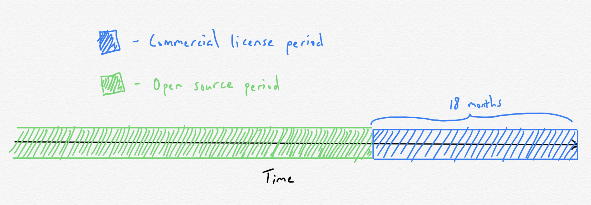

# Why I'm Switching from VSCode to OniVim 2
_August 18th, 2020 · #open_source_

As someone interested in open source sustainability, I recently heard about a very interesting open source licensing scheme that a project called [OniVim 2](https://github.com/onivim/oni2) uses. The central premise of the project itself is to combine the efficient modal editing functionality of Vim with a modern text editor UI.

## How OniVim’s Licensing Scheme Works

The OniVim 2 editor is currently under active development by [Outrun Labs](https://www.outrunlabs.com/). Any updates pushed to the project by them go under a commercial license; this is the closed source half of the scheme. Conversely, any updates merged into the project from outside Outrun go under an MIT license; this is the open source half of the scheme. Lastly, any code licensed under the commercial license is transferred over to the MIT license after an 18 month window.

Anyone can freely use the 18-month-old version of the project. For those who wish use the up-to-date version, a commercial license must be purchased.

You can read more about the why and how of this scheme [here](https://onivim.github.io/docs/other/motivation#a-new-model-for-sustainability).

## The Vim Editor I Never Knew I Needed

I’ve been trying to embrace Vim for years, but have, up to this point, been mostly unsuccessful. I’ve internalized the fundamental Vim keybindings, but have never gotten much further than that. I would always become overwhelmed with the sheer amount of freedom and choice when it came to how much you could customize your Vim experience through plugins and other customizations. 

Certainly there are people who love the level of customizability that Vim provides. I prefer something sensible out-of-the-box that doesn’t require ~~any~~ much fiddling, with the option for configurability should the need arise (this is probably why I'll likely never migrate off of OSX).

For a long time I defaulted to VSCode with the Vim keybindings plugin enabled. However, this always felt like a subpar compromise; VSCode is clearly not built with Vim keybindings in mind. 

The first time I fired up an instance of OniVim 2, I was blown away by the snappiness of it. That, and the fact that it is very clearly designed around the modal editing experience, prompted me to shell out for a commercial license right then and there. 

OniVim 2 is a “batteries included” editor from the get-go, but one of its most powerful extensibility features is the fact that it allows users to hook into the VSCode plugin ecosystem. As a result, installing and enabling useful extensions will be just as easy with OniVim 2 as it is with VSCode. 

There’s certainly a lot of potential here, but at the same time, keep in mind that the project is still in an alpha stage. There are many key features still missing at this point, such as an autosave feature (so you have to keep typing `:w` every so often), as well as being able to pull in your `.vimrc` file for further customization (this is super important as it will enable a more seamless transition for vim/neovim users). I also ran into an [issue](https://github.com/onivim/oni2/issues/2307#issuecomment-675731640) where a missing extension file needed for Haskell syntax highlighting caused the entire program to crash. 

Despite these issues, I’m very much looking forward to following along with OniVim’s development as time goes on and seeing the incremental improvements to the overall editing experience!

## Some Reasons Why Open Source Isn’t Sustainable

In addition to having the potential to become an editor that I can see myself adopting as my go-to, I’m also really interested in seeing how things shake out for OniVim on the sustainability front. 

Nadia Eghbal, in her new book [_Working in Public_](https://www.goodreads.com/book/show/54140556-working-in-public), argues that the widespread notion that the main problems open source communities face is a lack of contributors and/or a lack of funding don’t reveal the whole scope of the problem. 

She makes the point that in recent years, contributing to open source projects has become very frictionless, due in large part to the proliferation and innovations of GitHub. But this ends up resulting in very high _turnover rate_ for open source projects. 

Maintainers end up having to spend a lot of time interfacing with the revolving door of casual contributors looking to submit a PR or two to their project. Ultimately, this is work that most maintainers do not want to be doing in their spare time, which is a recipe for maintainer burnout. 

## How OniVim’s Licensing Scheme (Partly) Addresses These Issues

One possible way to address the unsustainable nature of open source, according to Nadia in her book, is to make it _harder_ for people to contribute to open source projects. The idea being that _committed_ users and contributors are more invested in a project, which often leads to higher-quality contributions. 

The really cool thing about OniVim’s licensing scheme is the fact that it kills two birds with one stone. On the one hand, charging for commercial licenses means the project has some funding that benefits the maintainers. One the other hand, it also provides a way to filter for the more _committed_ users! 

The maintainers of OniVim mention [here](https://onivim.github.io/docs/other/motivation#focusing-on-the-right-priorities) that, as the project attracts more users, issues will be prioritized based on whether it was logged by a user who owns a commercial license. This means they’ll be spending less time triaging and responding to issues, and more time iterating on the project itself. 

Some open questions in my mind include:

Will it lead to a more sustainable workflow for the maintainers down the line? Will prioritizing the issues raised by paying users lead the project down a good direction? Will the financials and the economics end up working out? 

With all that being said, I’m really curious to see how this licensing scheme works out for the OniVim maintainers long term!
