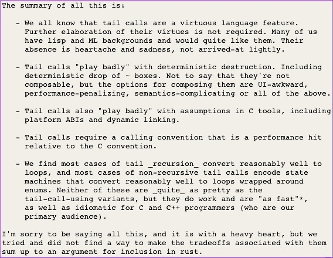

# The Story of Tail Call Optimizations in Rust
_June 3rd, 2020 | #rust | #open_source_

I think tail call optimizations are pretty neat, particularly how they work to solve a fundamental issue with how recursive function calls execute. Functional languages like Haskell and those of the Lisp family, as well as logic languages (of which Prolog is probably the most well-known exemplar) emphasize recursive ways of thinking about problems. These languages have much to gain performance-wise by taking advantage of tail call optimizations.

> Note: I won't be describing what tail calls are in this post. Here are a number of good resources to refer to:
> - The YouTube channel Computerphile has a [video](https://youtu.be/_JtPhF8MshA) where they walk through examples of tail-recursive functions in painstaking detail.
> - A detailed explanation on [Stack Overflow](https://stackoverflow.com/questions/310974/what-is-tail-call-optimization) on the concept.

With the recent trend over the last few years of emphasizing functional paradigms and idioms in the programming community, you would think that tail call optimizations show up in many compiler/interpreter implementations. And yet, it turns out that many of these popular languages _don’t_ implement tail call optimization. JavaScript had it up till a few years ago, when it removed support for it [1](https://stackoverflow.com/questions/42788139/es6-tail-recursion-optimisation-stack-overflow). Python doesn’t support it [2](http://neopythonic.blogspot.com/2009/04/final-words-on-tail-calls.html). Neither does Rust. 

Before we dig into the story of why that is the case, let’s briefly summarize the idea behind tail call optimizations.

## How Tail Call Optimizations Work (In Theory)

Tail-recursive functions, if run in an environment that doesn’t support TCO, exhibits linear memory growth relative to the function’s input size. This is because each recursive call allocates an additional stack frame to the call stack. The goal of TCO is to eliminate this linear memory usage by running tail-recursive functions in such a way that a new stack frame doesn’t need to be allocated for each call.

One way to achieve this is to have the compiler, once it realizes it needs to perform TCO, transform the tail-recursive function execution to use an iterative loop. This means that the result of the tail-recursive function is calculated using just a single stack frame. Ta-da! Constant memory usage.


With that, let’s get back to the question of why Rust doesn’t exhibit TCO.

## Going Through the Rust Wayback Machine

The earliest references to tail call optimizations in Rust I could dig up go all the way back to the Rust project’s inception. I found [this][mailing_list] mailing list thread from 2013, where Graydon Hoare enumerates his points for why he didn’t think tail call optimizations belonged in Rust:



That mailing list thread refers to [this][gh_issue] GitHub issue, circa 2011, when the initial authors of the project were grappling with how to implement TCO in the then-budding compiler. The heart of the problem seemed to be due to incompatibilities with LLVM at the time; to be fair, a lot of what they’re talking about in the issue goes over my head.

What I find so interesting though is that, despite this initial grim prognosis that TCO wouldn’t be implemented in Rust (from the original authors too, no doubt), people to this day still haven’t stopped trying to make TCO a thing in rustc.

## Subsequent Proposals for Adding TCO into Rustc

In May of 2014, [this][pr_81] PR was opened, citing that LLVM was now able to support TCO in response to the earlier mailing list thread. More specifically, this PR sought to enable on-demand TCO by introducing a new keyword `become`, which would prompt the compiler to perform TCO on the specified tail recursive function execution.

Over the course of the PR’s lifetime, it was pointed out that rustc could, in certain situations, infer when TCO was appropriate and perform it [3](https://github.com/rust-lang/rfcs/issues/271#issuecomment-271161622). The proposed `become` keyword would thus be similar in spirit to the `unsafe` keyword, but specifically for TCO.

A subsequent [RFC][rfc] was opened in February of 2017, very much in the same vein as the previous proposal. Interestingly, the author notes that some of the biggest hurdles to getting tail call optimizations (what are referred to as “proper tail calls”) merged were:

- Portability issues; LLVM at the time didn’t support proper tail calls when targeting certain architectures, notably MIPS and WebAssembly.
- The fact that proper tail calls in LLVM were actually likely to cause a performance penalty due to how they were implemented at the time.
- TCO makes debugging more difficult since it overwrites stack values.

Indeed, the author of the RFC admits that Rust has gotten on perfectly fine thus far without TCO, and that it will certainly continue on just fine without it.

Thus far, explicit user-controlled TCO hasn’t made it into rustc.

## Enabling TCO via a Library

However, many of the issues that bog down TCO RFCs and proposals can be sidestepped to an extent. Several homebrew solutions for adding explicit TCO to Rust exist.

The general idea with these is to implement what is called a “trampoline”. This refers to the abstraction that actually takes a tail-recursive function and transforms it to use an iterative loop instead.

> How about we first implement this with a trampoline as a slow cross-platform fallback
implementation, and then successively implement faster methods for each architecture/platform?
> This way the feature can be ready quite quickly, so people can use it for elegant programming. In a future version of rustc such code will magically become fast.
 - [@ConnyOnny][connyonny], [4](https://github.com/rust-lang/rfcs/issues/271#issuecomment-269255176)

Bruno Corrêa Zimmermann’s [tramp.rs][tramp_rs] library is probably the most high-profile of these library solutions. Let’s take a peek under the hood and see how it works.

## Diving Into `tramp.rs`

The tramp.rs library exports two macros, `rec_call!` and `rec_ret!`, that facilitate the same behavior as what the proposed `become` keyword would do: it allows the programmer to prompt the Rust runtime to execute the specified tail-recursive function via an iterative loop, thereby decreasing the memory cost of the function to a constant.

The `rec_call!` macro is what kicks this process off, and is most analogous to what the `become` keyword would do if it were introduced into rustc:

```rust
macro_rules! rec_call {
    ($call:expr) => {
        return BorrowRec::Call(Thunk::new(move || $call));
    };
}
```

`rec_call!` makes use of two additional important constructs, `BorrowRec` and `Thunk`.

```rust
enum BorrowRec<'a, T> {
    Ret(T),
    Call(Thunk<'a, BorrowRec<'a, T>>),
}
```

The `BorrowRec` enum represents two possible states a tail-recursive function call can be in at any one time: either it hasn’t reached its base case yet, in which case we’re still in the `BorrowRec::Call` state, or it has reached a base case and has produced its final value(s), in which case we’ve arrived at the `BorrowRec::Ret` state.

> Note: Modeling the state of recursive functions in this way, with a `Call` state representing the fact that the function is still recursing and a `Ret` state indicating that the function has arrived at a base case, reminds me a lot of how async Promises are modeled. 
> Promises can be in one of three states, "pending", meaning it's still waiting on an asynchronous operation, "resolved", meaning the asynchronous operation occurred successfully, and "rejected", meaning the asynchronous operation did not occur successfully.

The `Call` variant of the `BorrowRec` enum contains the following definition for a `Thunk`:

```rust
struct Thunk<'a, T> {
    fun: Box<FnThunk<Out = T> + 'a>,
}
```

The `Thunk` struct holds on to a reference to the tail-recursive function, which is represented by the `FnThunk` trait.

Lastly, this is all tied together with the `tramp` function:

```rust
fn tramp<'a, T>(mut res: BorrowRec<'a, T>) -> T {
    loop {
        match res {
            BorrowRec::Ret(x) => break x,
            BorrowRec::Call(thunk) => res = thunk.compute(),
        }
    }
}
```

This receives as input a tail-recursive function contained in a `BorrowRec` instance, and continually calls the function so long as the `BorrowRec` remains in the `Call` state. Otherwise, when the recursive function arrives at the `Ret` state with its final computed value, that final value is returned via the `rec_ret!` macro.

## Are We TCO Yet?

So that’s it right? `tramp.rs` is the hero we all needed to enable on-demand TCO in our Rust programs, right?

I’m afraid not.

While I really like how the idea of trampolining as a way to incrementally introduce TCO is presented in this implementation, [benchmarks][benchmarks] that [@timthelion][timthelion] has graciously already run indicate that using tramp.rs leads to a slight regression in performance compared to manually converting the tail-recursive function to an iterative loop.


Part of what contributes to the slowdown of tramp.rs’s performance is likely, as [@jonhoo][jonhoo] points out, the fact that each `rec_call!` call allocates memory on the heap due to it calling `Thunk::new`:


So it turns that tramp.rs’s trampolining implementation doesn’t even actually achieve the constant memory usage that TCO promises!

Ah well. Perhaps on-demand TCO will be added to rustc in the future. Or maybe not; it’s gotten by just fine without it thus far.

## Links and Citations

1: [https://stackoverflow.com/questions/42788139/es6-tail-recursion-optimisation-stack-overflow](https://stackoverflow.com/questions/42788139/es6-tail-recursion-optimisation-stack-overflow)

2: [http://neopythonic.blogspot.com/2009/04/final-words-on-tail-calls.html](http://neopythonic.blogspot.com/2009/04/final-words-on-tail-calls.html)

3: [https://github.com/rust-lang/rfcs/issues/271#issuecomment-271161622](https://github.com/rust-lang/rfcs/issues/271#issuecomment-271161622)

4: [https://github.com/rust-lang/rfcs/issues/271#issuecomment-269255176](https://github.com/rust-lang/rfcs/issues/271#issuecomment-269255176)

[computerphile_video]: https://youtu.be/_JtPhF8MshA
[stack_overflow_tc]: https://stackoverflow.com/questions/310974/what-is-tail-call-optimization
[pr_81]: https://github.com/rust-lang/rfcs/pull/81
[mailing_list]: https://mail.mozilla.org/pipermail/rust-dev/2013-April/003557.html
[gh_issue]: https://github.com/rust-lang/rust/issues/217
[rfc]: https://github.com/DemiMarie/rfcs/blob/become/0000-proper-tail-calls.md
[tramp_rs]: https://crates.io/crates/tramp
[benchmarks]: https://gitlab.com/timthelion/trampoline-rs/commit/84f6c843658c6c3a5893effa031ce734b910171c
[jonhoo]: https://github.com/jonhoo
[connyonny]: https://github.com/connyonny
[timthelion]: https://github.com/timthelion
